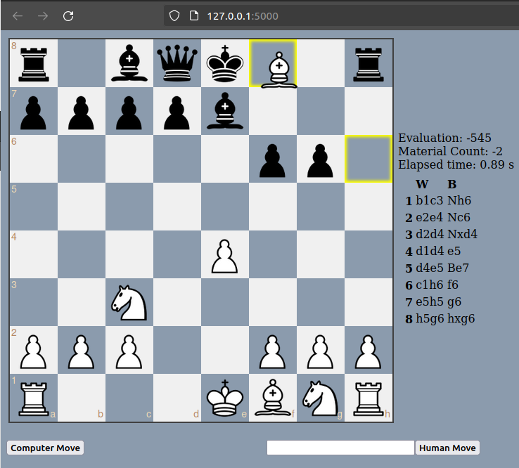

# ♘♗♖♕♔ Abadejo-Chess ♚♛♜♝♞

A Neural Chess AI in Python

## ♙ Description

This aims to be a simple and inefficient chess engine programed in Python for learning about AI, PyTorch and dataset generation

## ♙ Use

Run app.py with Python3, it works using flask on localhost, go to <http://127.0.0.1:5000/> for the move interface

- Simply drag the piece to the desired square, ilegal moves are rejected, promoting to queen is automatic, followed autmatically by an enemy computer move
  or:
- Human move: Makes the SAN notated move followed autmatically by an enemy computer move
- Computer move: Makes a move using the engine for the side currently playing

## ♙ Dependancies

**Python 3** of course

- [chess](https://pypi.org/project/python-chess/): A lifesaver, probably wouldnt have started the projet w/o this
- [numpy](https://pypi.org/project/numpy/): Efficient data structures
- [flask](https://pypi.org/project/Flask/): Interface
  
optional:

- [PyTorch](https://pypi.org/project/torch/): Neural evaluation (use pip, the conda version is too old)
- cProfile and snakeviz: for profiling to optimaze a little more

## ♙ Objetives

- [ ] Make a chess engine that can beat me :sunglasses:
- [x] Use a CNN for eval
- [x] Learn more about PyTorch and dataset generation

## ♙ TODO

- [x] User input via clicking
- [x] Info in the webpage
- [x] NegaMax
- [x] [NegaMax + Zobrist Hash with alpha beta pruning](https://en.wikipedia.org/wiki/Negamax)
- [ ] Iterative deepening
- [ ] Aspiration Window
- [ ] Negascout (Principal variation search)
- [x] ~~Pypy~~ (Pypy 3.7 seems 1% to 10% slower than Python 3.8)
- [x] Piece value heuristic
- [x] MiniMax
- [x] Board rendering
- [x] Movility to the heuristic
- [x] MiniMax + Alpha Beta pruning
- [x] Piece square tables
- [x] Move ordering (moves that capture pieces may be examined before moves that do not, and moves that have scored highly in earlier passes through the game-tree analysis may be evaluated before others)
- [ ] Quiescence search
- [x] User input via submit field
- [x] Automatic enemy move
- [x] Zobrist Hashing
- [x] Tranposition tables
- [x] Neural network evaluation
